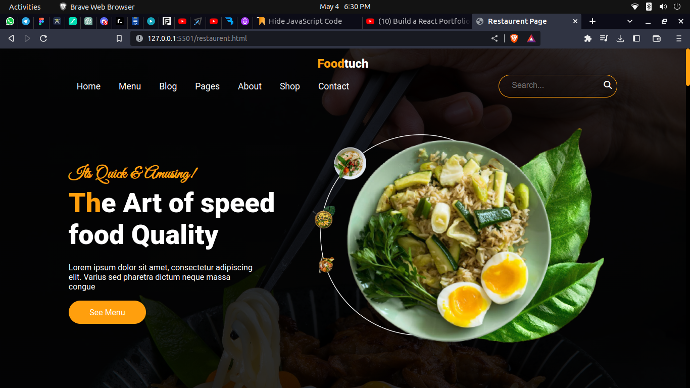
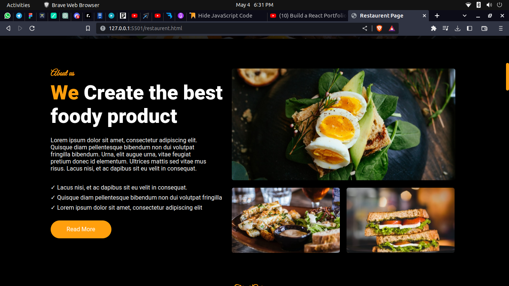
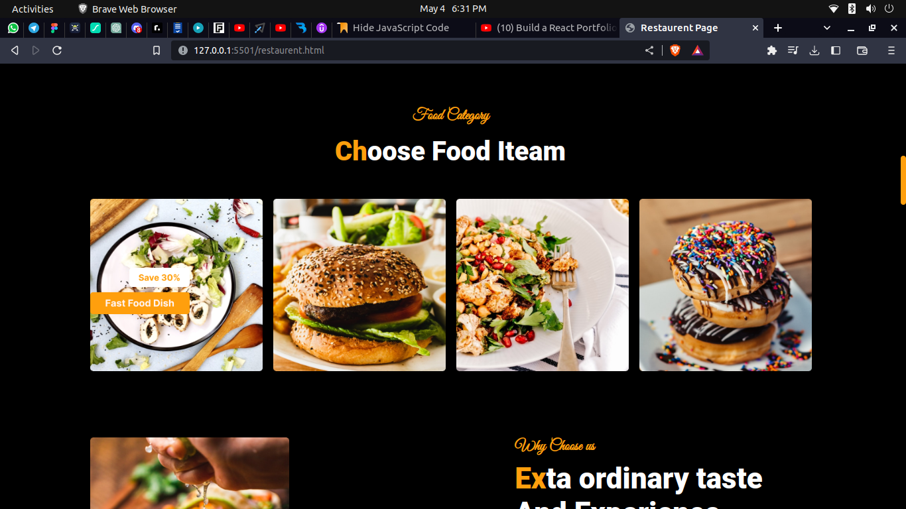
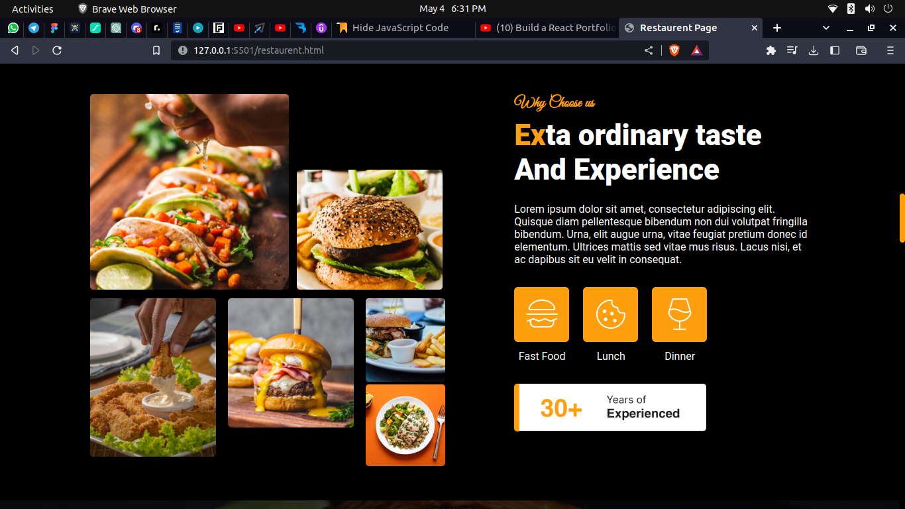
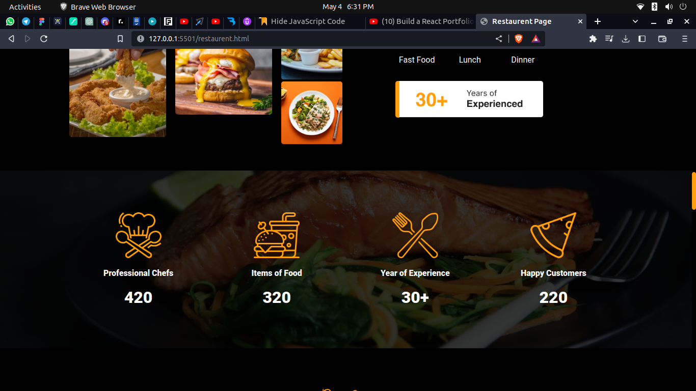
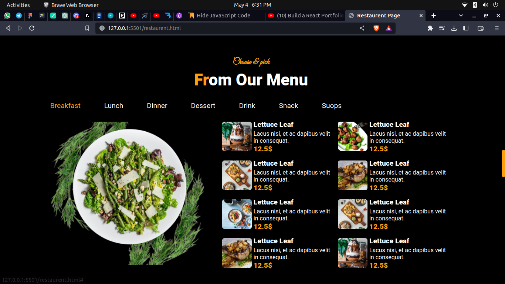
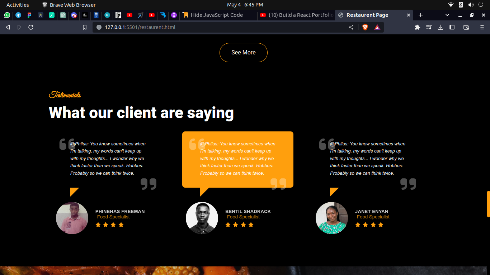
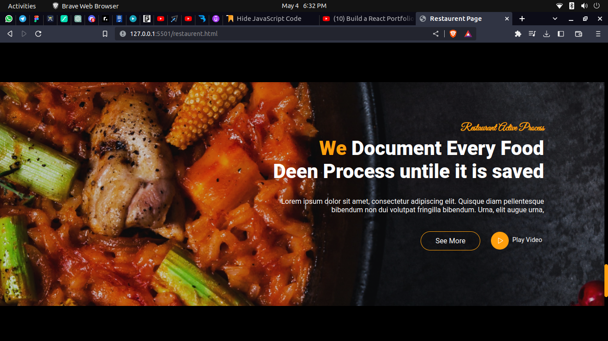
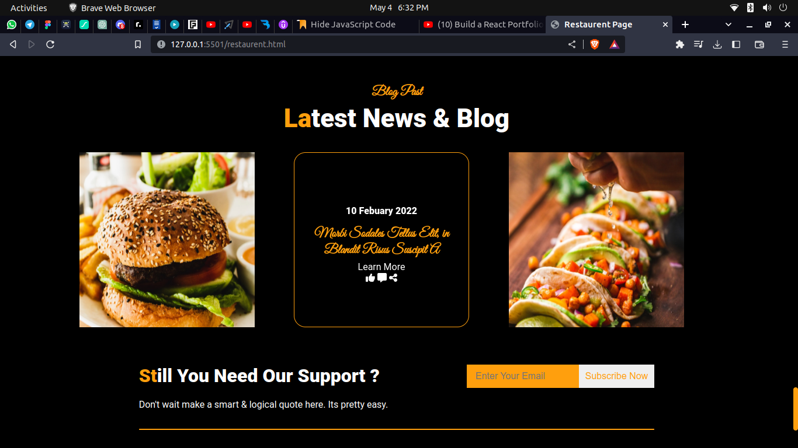
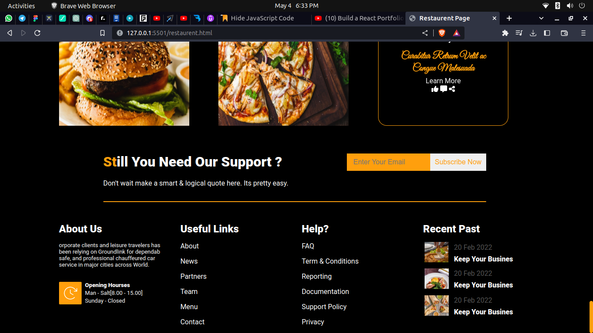

 
 
 <h1 align="center"> Not Responsive </h1>
  

  <h4 align="center"> 
	🚧  Foodtuch 🚀 Under construction...  🚧
</h4>    

  

    
    
    
    
    
    
    
    
    
    
    

  &#xa0;

<a href="#top">Back to top</a>
